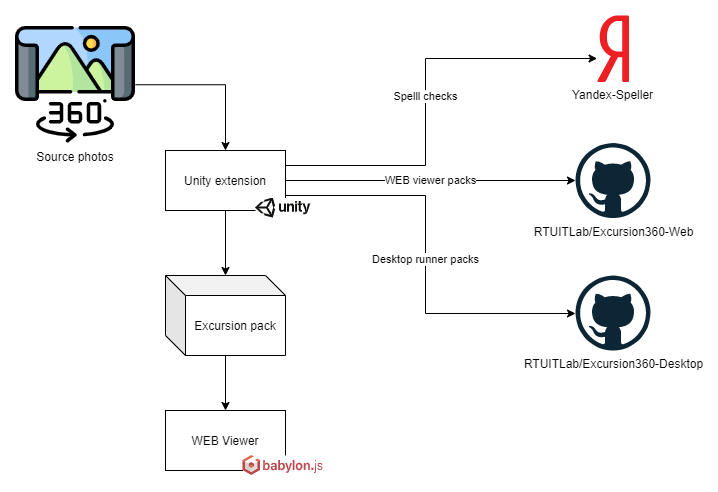

# Инстурмент для создания 360 экскурсий

## [Документация по использованию](Documentation/DOCUMENTATION.md)

## АРрхитектура

## Обновления
* `2023 10 11`
  * При экспорте инвертируются координаты вращения изображения по `x` и `z` для корректного отображения в Babylon.JS.
* `2023 10 05`
  * Для тура можно ставить флаг для быстрого возврата на первую локацию из любой другой.
* `2023 10 04`
  * У FieldItem есть поле debugTitle для отображения в редакторе, если у объекта нет публичного названия.
* `2023 09 29`
  * Добавлена возможность устанавливать изображение для сокрытия штатива, нужно добавить png/jpg в Tour.
* `2023 09 28`
  * Добавлен флаг, регулирующий необходимость зацикливания и продолжения при возврате фонового аудио
* `2023 09 20`
  * Исправлены аргументы при сборке живого превью
* `2023 07 18`
  * К состояниям можно привязать аудио сопровождение
* `2023 06 30`
  * У интерактивных элементов при отсутствии контента показывается предупреждение
* `2023 06 29`
  * Интерактивные элементы создаются кнопкой внизу и сразу раскрыты.
* `2023 06 27`
  * Добавлен дополнительный редактор, позволяюший преобразовывать панорманые снимки к прямоугольным.
* `2023 06 20`
  * Оптимизация веса экскурсии за счет снижения качества (без видымых изменений) + изменения разрешений текстур (до 4096). Объем уменьшился примерно в 10 раз.
* `2023 06 19`
  * Отображение/скрытие всех интерактивных элементов.
  * При переопределении направления на состояние сразу включается режим редактирования.
* `2023 06 16`
  * Интерактивные элементы
    * Интерактивные элементы редактируются при помощи собственного "редактора массивов", так как редактор по умолчанию не сохраняет текстуру.
    * При редактировании вершины интерактивного элемента не отрисовывается его "квадрат", для возможности более точного позиционирования.
    * Можно скрыть отображение конкретных интерактивных элементов для простоты редактирования радом находящихся.
  * Идентификаторы состояний сохраняются в проекте, чтобы путь к результирующим сценам на сайте не менялся между сборками.
  * Обновлен способ обработок ошибок http запросов на актуальный.
