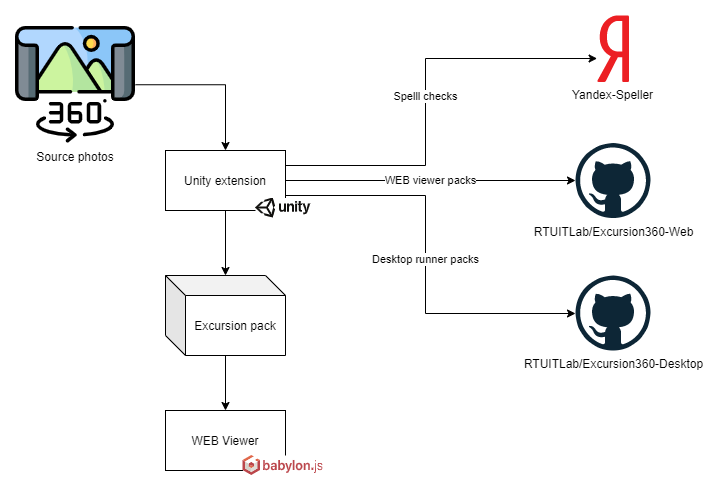

# Инстурмент для создания 360 экскурсий

## Установка в Unity проект
1. Добавить как [git submodule](https://www.git-scm.com/book/en/v2/Git-Tools-Submodules)
    ```bash
    git submodule add https://github.com/RTUITLab/Excursion360-Builder.git Packages/Excursion360-Builder
    ```
2. Добавить папку с ресурсами в .gitignore
    ```gitignore
    Assets/Tour creator/
    ```
3. Переключиться с конкретного коммита на `master` ветку для удобства
    ```bash
    cd Packages/Excursion360-Builder
    git checkout master
    ```

Далее для обновления сборщика будет достаточно выполнить
```bash
cd Packages/Excursion360-Builder
git pull
```

## Возможные проблемы
В проекте используется пространство имен `Newtonsoft.Json`. Пока не принято решение, как эта библиотека должна поставляться в автоматическом режиме вместе с пакетом для сборки экскурсии, возможно её придется поставить в конкретный проект. Если это вызывает сложности - пожалуйста, свяжитесь с разработчиком плагина.

## [Документация по использованию](Documentation/DOCUMENTATION.md)

## Архитектура



## Обновления
* `2025 12 01`
  * При указании одного и того же аудио для фотографий воспроизведение не прерывается во время переключения между фотографиями.
  * Если фотография имеет скорректированный формат инструментом подгонки под прямоугольную форму документа - именно эта форма будет экспортирована, даже если в field item указан исходный файл.
* `2025 11 27`
  * !BREAKING CHANGE! Версия протокола изменена с `0.9` на `0.10`. Теперь вместо списка ссылок на изображения в интерактивном элементе прикладывается список объектов, описывающих изображение. Где есть как ссылка на изображение, так и его описание и аудио сопровождение для конкретного изображения.
  * Редактор постепенно переводится на русский язык, переведена секция интерактивных элементов
  * Для сериализации основной модели экскурсии используется `Newtonsoft.Json` вместо встроенного в Unity `JsonUtility`, миграция произведена из-за того, что встроенный инструмент сериализует все объекты, даже null, что делает невозможным проверку на наличие того или иного свойства в инструменте отображения экскурсии.
* `2025 06 24`
  * Исправлена работа с камерой в превью режиме
* `2024 05 05`
  * Добавлено создание пустого `/eapi/preload.json`, для корректной работы алогиртма предзагрузки при размещении экскурсии в формате статичных файлов
* `2023 12 21`
  * Убрана ненужная кнопка в редакторе интерактивных элементов
  * В проекте теперь сохраняется дата последней сборки, и версия просмотрщика для удобства при отслеживании обновлений
* `2023 12 20`
  * В меню редактора добавлен флаг для отображения порядковых номеров field item-ов в рамках сцены. Полезно для ориентирования при множестве объектов без названия.
  * Удалены ненужные using, которые приводили к невозможности использования редактора на некоторых проектах.
  * Обновлена инструкция по добавлению проекта
* `2023 12 12`
  * Для каждой локации можно указать направление, куда будет смотреть камера при открытии локации по ссылке
* `2023 12 05`
  * Добавлена возможность размещать на локации изображения
  * На групповых переходах можно регулировать высоту заголовка относительно переходов
* `2023 10 26`
  * Для групповых переходов можно настроить режим отображения - показывать как обычно, или оставить только сами кнопки, без "сферы"
* `2023 10 11`
  * При экспорте инвертируются координаты вращения изображения по `x` и `z` для корректного отображения в Babylon.JS.
* `2023 10 05`
  * Для тура можно ставить флаг для быстрого возврата на первую локацию из любой другой.
* `2023 10 04`
  * У FieldItem есть поле debugTitle для отображения в редакторе, если у объекта нет публичного названия.
* `2023 09 29`
  * Добавлена возможность устанавливать изображение для сокрытия штатива, нужно добавить png/jpg в Tour.
* `2023 09 28`
  * Добавлен флаг, регулирующий необходимость зацикливания и продолжения при возврате фонового аудио
* `2023 09 20`
  * Исправлены аргументы при сборке живого превью
* `2023 07 18`
  * К состояниям можно привязать аудио сопровождение
* `2023 06 30`
  * У интерактивных элементов при отсутствии контента показывается предупреждение
* `2023 06 29`
  * Интерактивные элементы создаются кнопкой внизу и сразу раскрыты.
* `2023 06 27`
  * Добавлен дополнительный редактор, позволяюший преобразовывать панорманые снимки к прямоугольным.
* `2023 06 20`
  * Оптимизация веса экскурсии за счет снижения качества (без видымых изменений) + изменения разрешений текстур (до 4096). Объем уменьшился примерно в 10 раз.
* `2023 06 19`
  * Отображение/скрытие всех интерактивных элементов.
  * При переопределении направления на состояние сразу включается режим редактирования.
* `2023 06 16`
  * Интерактивные элементы
    * Интерактивные элементы редактируются при помощи собственного "редактора массивов", так как редактор по умолчанию не сохраняет текстуру.
    * При редактировании вершины интерактивного элемента не отрисовывается его "квадрат", для возможности более точного позиционирования.
    * Можно скрыть отображение конкретных интерактивных элементов для простоты редактирования радом находящихся.
  * Идентификаторы состояний сохраняются в проекте, чтобы путь к результирующим сценам на сайте не менялся между сборками.
  * Обновлен способ обработок ошибок http запросов на актуальный.
